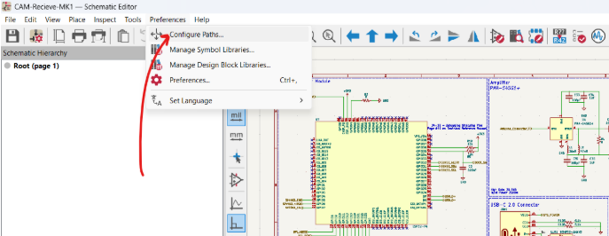
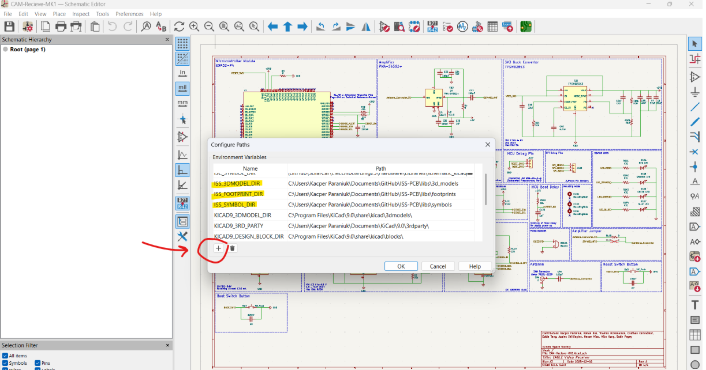
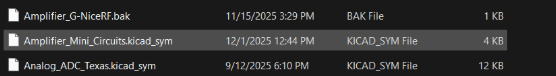
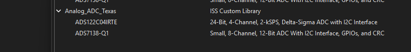
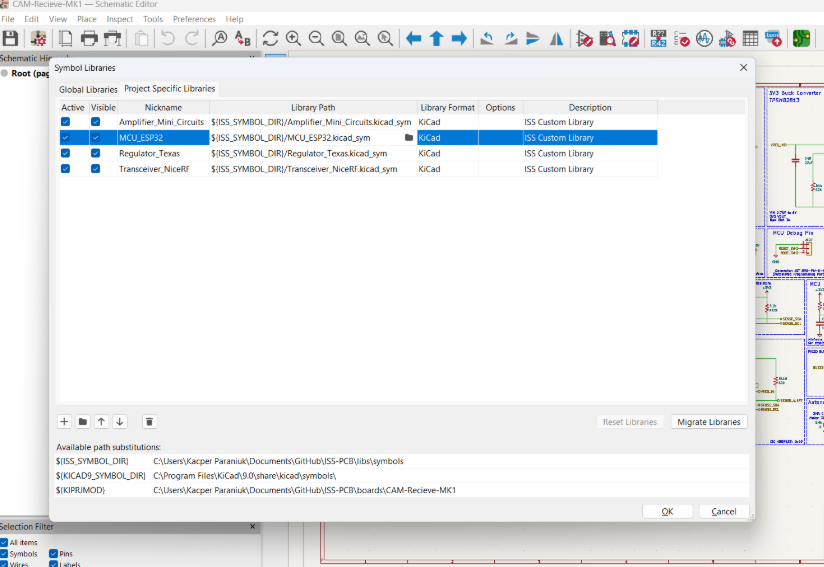
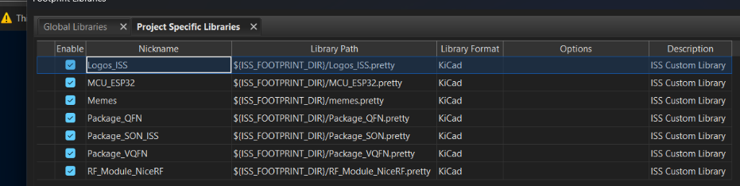

# **Contributing Guide**

*Author(s): Peter Giannetos, Thomas McManamen, Kacper Paraniuk, Eddie Tang*

KiCad files are more difficult and delicate to merge than standard code. Working with multiple contributors requires a specialized workflow. Please use the following guide below as a reference.

## Table of Contents

- [Quickstart](#quickstart)
- [Branches](#branches)
- [Pull Requests](#pull-requests)
- [KiCad Parts Library](#kicad-parts-library)
  - [ISS Naming Conventions for KiCad Parts](#iss-library-convention)
- [Merge Conflicts](#merge-conflicts)
- [Example Workflow](#example-workflow)
- [ISS KiCad Project Naming](#iss-kicad-project-naming)

 

# **Quickstart**

How to quickly get started via terminal commands.

## Install KiCad

The Electronic Design Automation (EDA) software used to design our Printed Circuit Boards (PCBs). Install the latest stable release of KiCad v6 and up. This guide was originally written for KiCad v6 but applies to later versions as well.

1. Download KiCad: [kicad.org/download](https://www.kicad.org/download/)

## GitHub Proficiency

The rest of this guide assumes you are somewhat familiar with Git and GitHub. Below is a link to our GitHub guide, but there are also many other online resources and tutorials if you search.  
[GitHub Guide](/GITHUB.md)

## Cloning the Repository

1. Create a folder where you'd like to localy store the repository.  
2. Navigate to that folder.  
    `cd /c/Users/Your_PC_Name/Desktop/ISS`
3. Clone the repository.  
    `git clone https://github.com/ISSUIUC/ISS-PCB`
4. Check the status of the repository. *(Optional)*  
    `git status`

 

# **Branches**

There are two used branch types in this repository.

- ### **Main**

  - The primary branch that only stores finished projects
  - Do not directly push to this branch! (Pull requests only!)
  - Example: `main`

- ### **Project_Dev**

  - Projects that are being actively developed
  - Used to review work from branches via pull requests
  - Do not directly push to this branch! (Pull requests only!)
  - Example: `TARS-MK4-dev`

## **Branch Rules**

There are six rules you must follow when working in branches to avoid merge conflicts and loss of work.

1. ### **Pull Often**

   - `git pull` before every time you begin working and before pushing. This ensures you have the most recent edits from other contributors on the same branch. As a general rule you can never `git pull` too much.
  
2. ### **Merge Often**

   - Merge your work into the Project_Dev branch with a pull request. This allows for new branches to have your work and current branches to rebase with your work. **If your work is incomplete, create a draft pull request to still receive feedback.**

3. ### **Single File Commits**

   - Only `git add` one file per `git commit`. However, you may have multiple commits per `git push`. **KiCad will ghost edit files even if you don't open them.** This will cause `git status` to mark them as edited even though no actual changes were made. In short, never automatically add all the 'edited' files to a commit. You must deliberately `git add` the individual files you opened and edited. This also ensures you don't accidentally add any random files.
  
4. ### **One Branch Per File**

   - There should only be one branch editing a specific file. However a single branch may edit multiple files. This ensures no parallel work is happening on a specific file between multiple branches. This would cause merge conflicts and some work is almost always lost.

5. ### **No Simultaneous Editors Per Branch**

   - Only one person can edit a branch at a time. Co-contributors must coordinate with each other to ensure that only one person is activly editing.

6. ### **Stay Within Your Branch's Scope**

   - Do not edit files beyond the scope of your branch for your project. This includes editing files in other project folders and other files in your project folder. This ensures you don't cause merge conflicts for someone else's work on another branch, and that the Project_Dev branch doesn't accidentally edit other projects in Main or other Project_Dev branches. Adding files to the KiCad Parts Library is allowed as long as the parts are related to your work. Rule #4 is the best way to ensure compliance.

7. ### **Focused Branch Scope**

   - Focused branches should be focused on completing a specific task. This allows you to finish the work faster, receive feedback faster, merge the branch into the Project_Dev branch faster, and start work on a newer up to date branch faster. For example `Route-FCB-Sensors` is relatively focused, but `Finish-FCB` is not and can have a broad interpretation.

## **Branch Protection**

The `main` and `Project_Dev` branches should be locked down and require pull requests and peer review to add new work. Even admins should have to abide by these restrictions.

## **Naming Branches**

Keep the naming of branches consistent between each other.
- **Project_Dev:** `PROJECT_NAME-dev` ➡ `TARS-MK4-dev`
- **Other Branches:** Name them according to their task/purpose
  - The branch this contributing guide was made on was called `Contributing`

 

# **Pull Requests**

Pull requests (PRs) are how to submit work for peer review and merge into Project_Dev branches or main. Submit pull requests as soon as possible in the development cycle to receive feedback early. It is recommended that PRs and comments are made through GitHub.com and not via the command line.

## **Peer Review Guidelines**

- Annotate schematics and PCBs before submitting PR's to allow for easier referencing
- Open "Draft" pull requests to review work that is not yet ready to merge.
- Two additional contributors not directly involved with the work should review every pull request before merging.
- Reviews requesting modifications should try to include the component reference number and a checkbox list.
- Critiques should be directed towards the work and not the individual. Be respectful, everyone at one point knew nothing about KiCad.
- If you have an open PR, check GitHub diligently for new comments. It should be an active discussion section for reviewing work. (You can configure notifications to your exact preferences.)

 

# **KiCad Parts Library**

KiCad has a rich default library of parts but often we need to create custom part files for unique components. If the part files can not be found online then custom files can be made with the built-in symbol editor, footprint editor, and your choice of CAD software.

- [SnapEDA](https://www.snapeda.com/)
- [Ultra-Librarian](https://www.ultralibrarian.com/) 

 *Download free symbols, footprints, & 3D models for millions of electronic components.* 

## **Files Types**

There are three main categories of part files. When adding new components please ensure you source or create all three types.

- ### **Symbols**

  - Used to create schematics and easily diagram electrical connections
  - `.kicad_sym` : A library file containing multiple unique component symbols.

- ### **Footprints**

  - Used to map and route the physical layout of the components
  - `.pretty` : A library folder containing multiple `.kicad_mod` files 
  - `.kicad_mod` : An individual component footprint

- ### **3D Models**

  - Used to render 3D images of the boards
  - `.3dshapes`: A library folder containing multiple `.step` and `.wrl` files 
  - `.step` : An individual component 3D model
  - `.wrl` : An individual component 3D model with texture data for advanced rendering *(Optional)*

## **Library Directory** 

The custom library used by all the projects in this repository is stored in the root of the repository under the `/libs` folder. Any new parts should be added here.

## **Custom Library Paths** 

When adding custom libraries to a project, you must point KiCad to the library file using a path linked to the repository and not your local computer, or else the library will not load correctly when the project is opened by other contributors.

- ### **Creating Paths**

  - In KiCad, locate Preferences ➡ Configure Paths

  - Create new variables: `ISS_SYMBOL_DIR`, `ISS_FOOTPRINT_DIR`, and `ISS_3DMODEL_DIR`
  - Set the locations to those of the `symbols`, `footprints`, and `3d_models` folders within the `lib` folder of your local repository. 

  
- ### **Accessing Settings**

  - **Schematics:** Symbol Editor ➡ Preferences ➡ Manage Symbol Libraries ➡ Project Specific Libraries  
  - **Footprints:** Footprint Editor ➡ Preferences ➡ Manage Footprint Libraries ➡ Project Specific Libraries
  - **3D Models:** Footprint Editor ➡ Open Footprint ➡ File ➡ Footprint Properties ➡ 3D Models  

- ### **Setting the Path**

    (KiCad may autofill the path if you set it up correctly.)
  - **Symbols:** `${ISS_SYMBOL_DIR}` copy this and replace everything before the `file.kicad_sym` file in the path for the library file
  - **Footprints:** `${ISS_FOOTPRINT_DIR}` copy this and replace everything before the `file.pretty` folder in the path for the library file
  - **3D Models:** `${ISS_3DMODEL_DIR}` copy this and replace everything before the `file.3dshapes` folder in the path for the library file
  - ${ } tells KiCad to look in the folders specified by the path variable. KiCad then searches for the rest of the file path as normal.
  - Replace all \ with / in file paths

- ### **Library Table**

  Every time you import a new custom library to a specific project you must save and push the following files or else your library and relative path won't be imported!

   - `sym-lib-table`: Table of custom imported symbol libraries
   - `fp-lib-table`: Table of custom imported footprint libraries
   - `fp-info-cache`: GARBAGE! DO NOT PUSH THIS. It's a local cache of your libraries for faster loading on your PC. It's safe to delete but will be regenerated.

Below is a good example with a relative path and a bad example with a user specific path. The steps to import a library are also shown. Navigate to this window by following the "Accessing Settings" section.

## **ISS Library Convention** 

### **Naming Conventions for Symbols, Footprints, 3D-Models**

#### **ISS Symbols Folder**

The convention for naming `.kicad_sym`, `.kicad_mod`, `.3dshapes` is very simple: 

“The general name for what it is (ex: MCU, Amplifier, Clock... etc) ” + “_” + “company who made it”

Inside of symbol library symbol should be named by: “what it specifically is (ex: part number)”

#### **Project Specific Libraries**

Should be named with the exact same formatting as inside of a [ISS Symbols Folder](https://github.com/ISSUIUC/ISS-PCB/blob/conventions/CONTRIBUTING.md#iss-symbols-folder): “What it is” + “_” + “company who made it”

##### **Symbols** 

##### **Footprints** 

## **KiCad Library Convention**

ISS provides an easy naming scheme/directions for custom libraries for members to not have to go through the hassle of looking at KiCad Library conventions. However, KiCad's Library Conventions should still be the main point of reference.

The KiCad Library Convention (KLC) is a set of guidelines for contributing to the official KiCad libraries. **Read over these requirements beforehand and follow them when making custom libraries.** Our libraries follow the same guidelines. All libraries should be created with the intent to upstream them to the official KiCad Libraries. It is **important** to note that many downloaded libraries are often not up to KLC thus shouldn't be blindly added to our libraries. 

- [KiCad Library Convention](https://klc.kicad.org/): *Library maintainer rules & guidelines*

*All libraries should follow the KLC before merging to main* 

 

# **Merge Conflicts**

If you ever run into merge conflicts, which are common with KiCad, there are a few methods you can take to resolve them. However, there is always a chance that some work may be lost, which is why following the proactive measures in the sections above is crucial.

1. ### **New Branch:**

    - If you are unable to merge a branch, you can create a new branch and then copy over any work from the old branch to the new branch. This is often the best solution for branches.

2. ### **File Editing:**

   - If you are experienced with KiCad, merge conflict(s) can sometimes be solved by manually editing the files line by line. VSCode or any other text editor should be able to open the files. Be warned that this method is the most complex and likely to cause other issues if done incorrectly. 

   - Fun Fact: You can automate KiCad tasks with Python by editing these text files directly or by using the KiCad Python API. However, there is very little documentation regarding this topic.

3. ### **Fresh Start:**

   - If your entire **local** repository is acting strange and you can not solve it within 20 minutes, you can opt to re-clone the repository in a new folder. You can delete your old local repository if you have no work that you want to save! It is recommended that you copy and paste any work you want to keep from the old repository to the new local repository, and then delete the old repository.

# **Example Workflow**

Here is a barebones demo of a typical workflow when working with branches.

1. Run `git pull` to make sure you have the latest version
2. Make sure you are on the correct branch; If not run `git checkout BRANCH_NAME`
3. Do some work
4. Run `git status` to see the files you've edited
5. Run `git add FILE_PATH/FILE_NAME` for every individual file you'd like to add
6. Run `git status` to make sure you added the correct files.
7. Run `git commit -m "Type Your Comment Here"` to make a commit with your changes
8. Run `git push` to upload your changes to GitHub

### **Cleaning Local Repositories**

You can clean your repository by running the following commands. Just make sure you commit and push any unsaved work first! We suggest doing this after every time you push to ensure you don't build a heap of untracked and modified files that'll make it more confusing when running `git add`.

- `git clean -d -n` a dry run of what untracked files your about to permanently delete
- `git clean -d -f` nukes every untracked directory 

   

# **ISS KiCad Project Naming**

E-Hardware follows this specific format for project naming when creating boards or new revisions. 

*See a typo? Think we left some vital information out? Make a branch and edit this file!*

<!---
To Do:
New files and folder naming: use - not _
Potentially garbage KiCAD files
Warning about uneatness will not be added to the repo
-->

