# **How-To KiCad Fundamentals**

*Author(s): Kacper Paraniuk, Thomas McManamen, Eddie Tang*

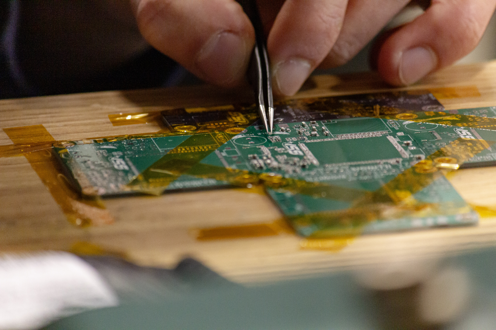

## Table of Contents

- [Symbols](#symbol-libraries)
    - [Finding ISS Symbol Library](#finding-iss-symbol-library)
    - [Setting Up Symbol Directories](#setting-up-symbol-directories)
    - [New Symbols](#new-symbols)
- [Footprints](#footprint-libraries)
    - [PCB Layer Overview](#pcb-layer-overview)
    - [Creating a New Footprint](#creating-a-footprint)
- [Importing Project Specifc Libraries](#importing-project-specific-libraries)
- [Creating Hierachical Sheets & Linking Hierachical Labels](#creating-hierachical-sheets--linking-hierachical-labels)
- [Layout Tutorials](#layout-tutorials)
    - [Setting Up Design Rules Contraints](#setting-up-design-rules-constraints-drc)
    - [Trace Impedance Matching](#trace-impedance-matching)
    - [Trace Sizing](#trace-sizing)
- [Instrumentation Tutorials](#instrumentation-tutorials)
    - [How to Use a Multi-Meter](#how-to-use-a-multi-meter)
    - [How to Use an Oscilloscope](#how-to-use-an-oscilloscope)
    - [How to Use a Digital Logic Analyzer](#how-to-use-a-digital-logic-analyzer)
    - [How to Solder](#how-to-solder)

# **Symbol Libraries**

## **What is a symbol?**

A symbol is a graphical representation of an electronic component which we use to show how the part connects electrically. 

### **Finding ISS Symbol Library** 

The location in your directory where ISS-PCB is located || ISS-PCB -> Libs > Symbols 

.kicad_sym is a collection of symbols (not symbols themselves) thus we will want to import a symbol into the correct library. Examples of .kicad_sym can include Analog_ADC_Texas. If there is no relevant library then we need to create a new library for the symbol. 

Find a graphic version of the ISS-PCB directory [here](https://github.com/ISSUIUC/ISS-PCB/blob/conventions/CONTRIBUTING.md#library-directory)

### **Setting Up Symbol Directories**

Take a look at [Contributing Page](https://github.com/ISSUIUC/ISS-PCB/blob/conventions/CONTRIBUTING.md#custom-library-paths) for a tutorial. 

## **New Symbols**

Ensure symbol names follow ISS conventions seen in [ISS Library Conventions](https://github.com/ISSUIUC/ISS-PCB/blob/conventions/CONTRIBUTING.md#iss-library-convention)

- Once KiCad is open go into Symbol Editor 

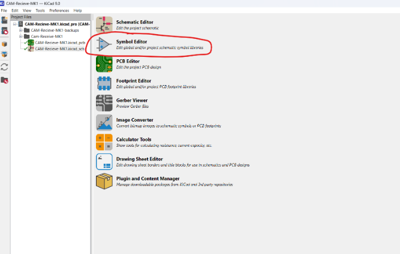

- Identify if you need a new symbol library or can you just import the symbol into an existing symbol library.

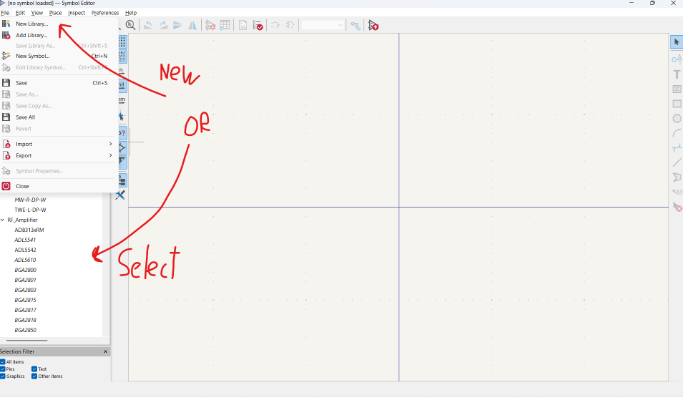

*Error: If you get an error that says “Symbol Library “name” is not writable” this means you are trying to write to a kicad library you need to import to an ISS folder.*

Either click to create a [New Symbol Library](#creating-a-new-symbol-library) or if you already have an existing symbol library that follows [conventions](https://github.com/ISSUIUC/ISS-PCB/blob/conventions/CONTRIBUTING.md#iss-library-convention) follow the steps to [import](#import-new-symbols-within-existing-library) or [create a new symbol](#creating-new-symbols)!

### **Creating a New Symbol Library** 

- Go into Symbol Editor 

- Click File > New Library 

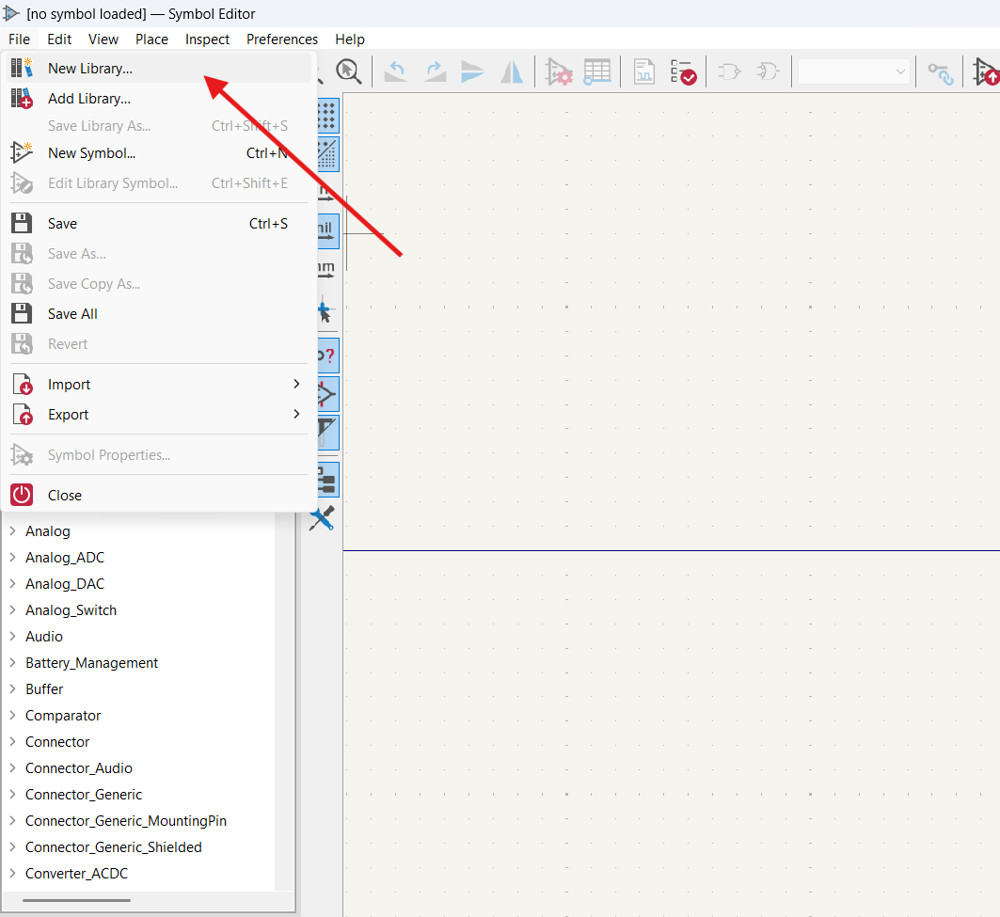

- Create a project specific library 

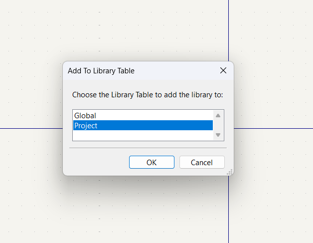

- Name libraires to [conventions](https://github.com/ISSUIUC/ISS-PCB/blob/conventions/CONTRIBUTING.md#iss-library-convention) and make sure to save the library in ISS-PCB\libs\symbols

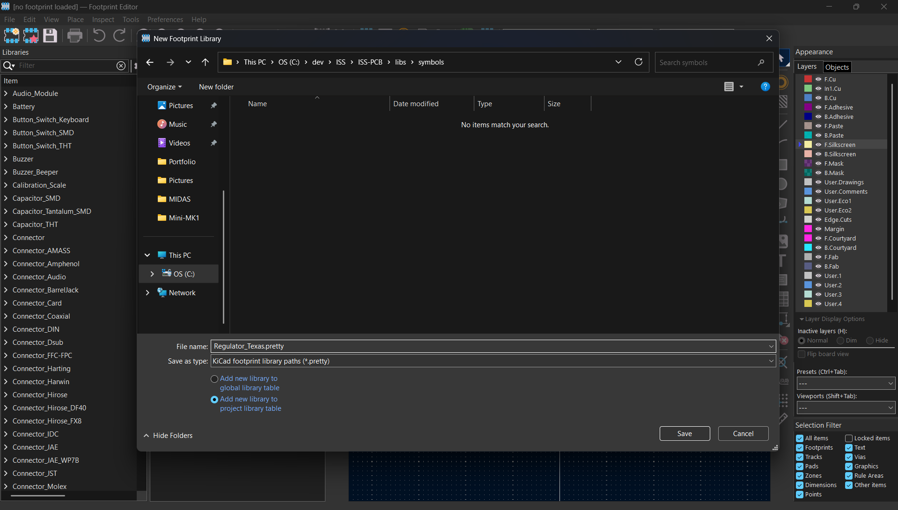

Follow the steps to [import](#import-new-symbols-within-existing-library) or [create a new symbol](#creating-new-symbols) into this project specifc library! Additionally, make sure to check if KiCad automatically imported the project specific library. If not then you’ll have to manually [import the project specific library](#importing-project-specific-libraries)

### **Import New Symbols within Existing Library**

*It is important to note symbols downloaded from online oftentimes need to be edited heavily to follow conventions*

Find the library and right click on it. Then click the import symbol. 

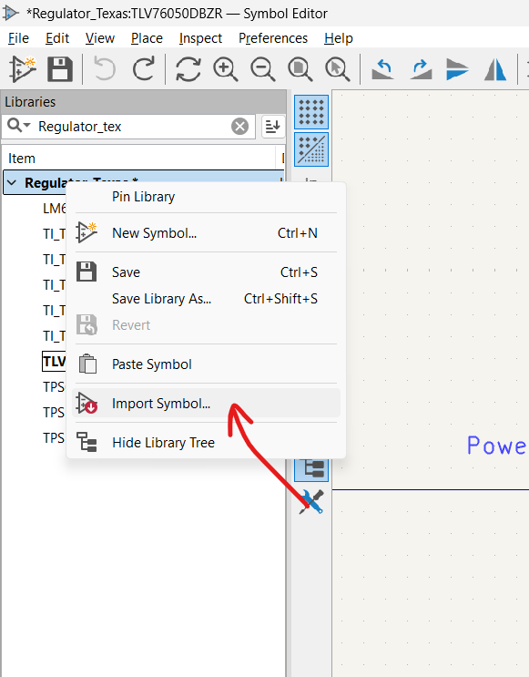

Give symbol name (should be the name of the component you are importing) and [reference designator](https://github.com/ISSUIUC/ISS-PCB/blob/conventions/ISS-PCB-CONVENTIONS.md#reference-designators) in this case: 

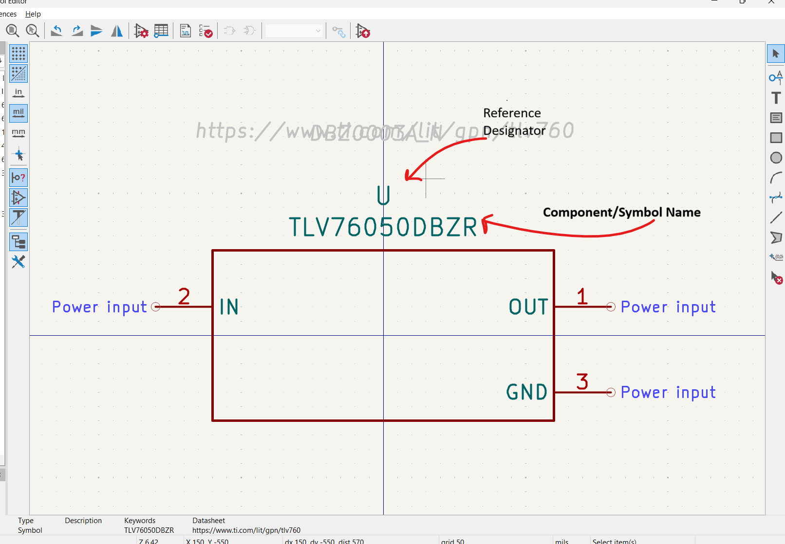

Make sure symbol is up to [conventions](https://github.com/ISSUIUC/ISS-PCB/blob/conventions/ISS-PCB-CONVENTIONS.md#symbol-conventions) (unlike the one above)

- Save! File > Save 

- Look up the name in (Place Symbols) in schematic editor 

### **Creating New Symbols**

Find the symbol library and right click on it. Then click “New symbol” 

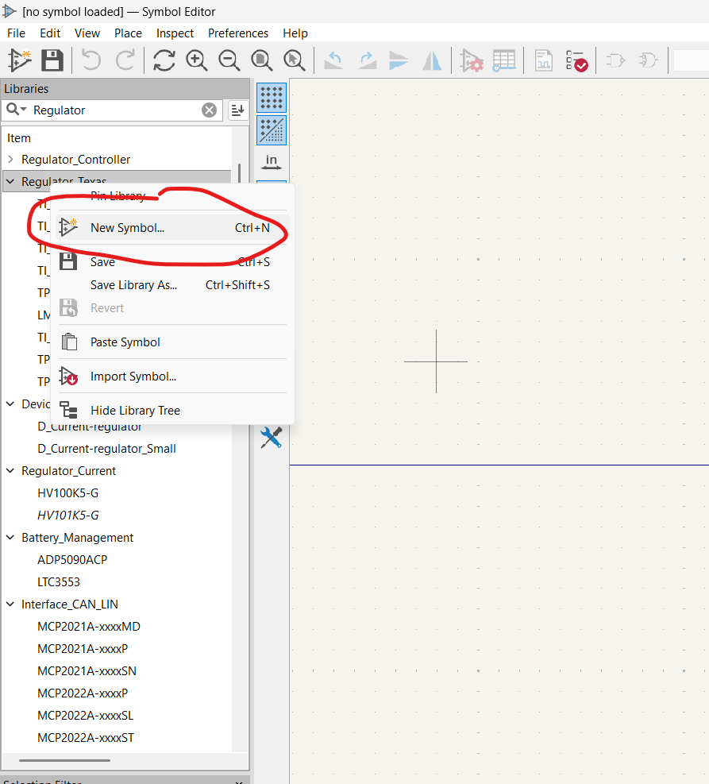

Give symbol name (should be the name of the component you are putting in) in this case TLV76050DBZR

- Symbol name specifies the associated MPN but any more specific is optional such as package type.

Assign [reference designator](https://github.com/ISSUIUC/ISS-PCB/blob/conventions/ISS-PCB-CONVENTIONS.md#reference-designators) according to IEEE standards 

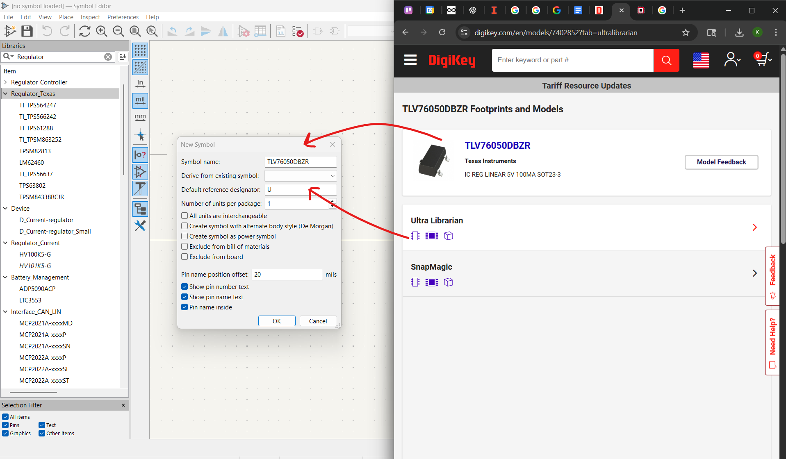

Place a rectangle, then appropriate pins, and look at [conventions](https://github.com/ISSUIUC/ISS-PCB/blob/conventions/ISS-PCB-CONVENTIONS.md#symbol-conventions) to check if you've created a symbol that follows ISS conventions. 

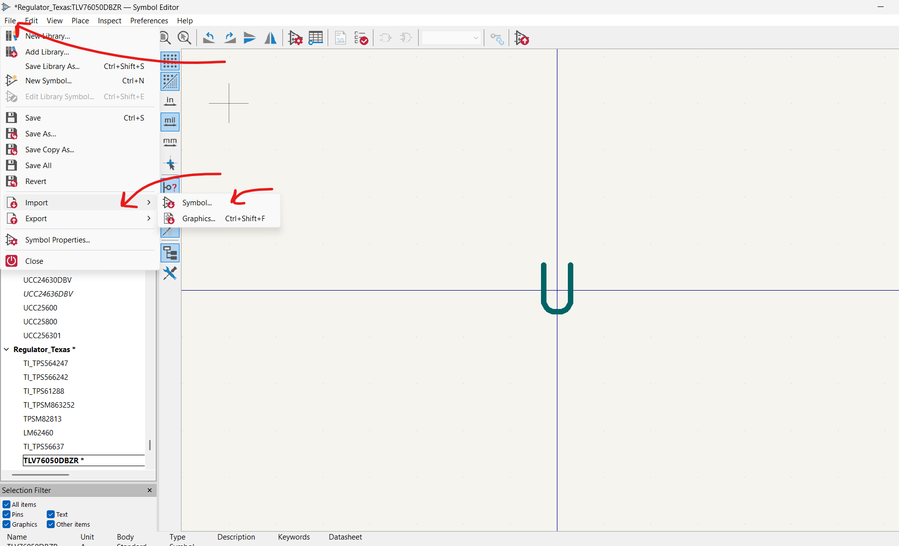

Save! File> Save 

Look up the name in schematic editor to check if your symbol was properly saved. 

# **Footprint Libraries**

### **Organizing Footprint Libraries**

Follow the exact same steps in [Symbol Libraries](#symbol-libraries) as for footprint libraries. However, make sure you click into "Footprint Editor" rather than "Symbol Editor" on the main homescreen of KiCad.

The process behind managing footprint libraries is identical to symbols and thus the same steps apply when managing footprint libraries and footprints. Instead of clicking *Symbol Editor* click *Footprint Editor* and the same steps as to [Symbol Libraries](#symbol-libraries) applies. The differences are file extensions and creating footprints. 

Ensure you are following [footprint conventions](https://github.com/ISSUIUC/ISS-PCB/blob/conventions/ISS-PCB-CONVENTIONS.md#footprint-conventions)

### **Creating a Footprint**

## **What is a footprint?**

A footprint represents the physical land pattern (pads) of an electronic component. It defines the shape and size of the copper pads to solder a component onto a PCB. 

#### **Reading Mechanical Drawings in Datasheets** 

The first step in creating a footprint is to find the mechanical drawing of the IC footprint as shown below: 

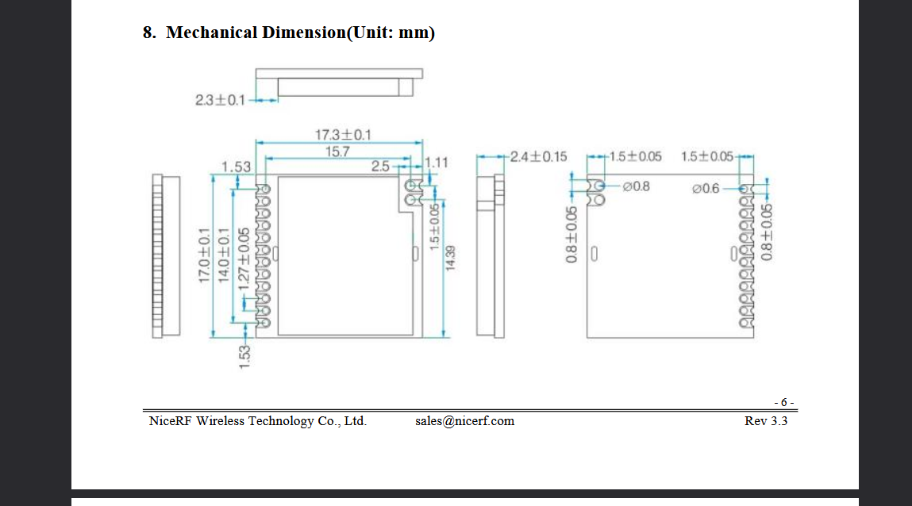

Next, open up 'Footprint Editor' and click 'File' > 'New Footprint'

Save right away and decide if this will go into an existing library or a new library. 

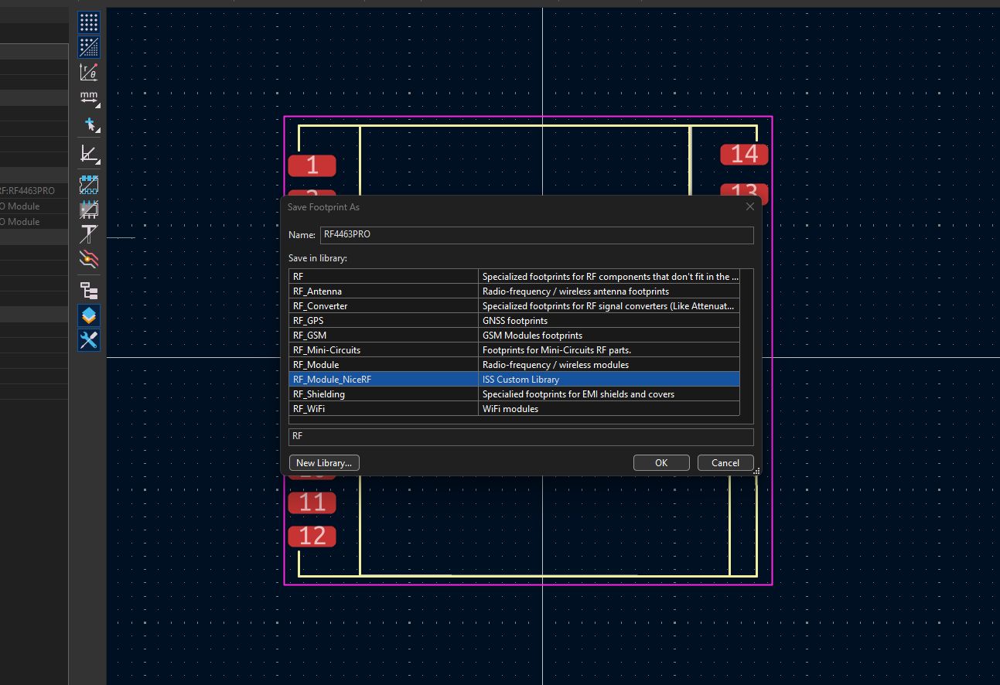

If existing search up the library and name the footprint. If a completely new library click new library... 

For actually creating the footprint we need to know what two layers are. 

#### **PCB Layer Overview**

KiCad uses multiple layers and it's important to know what they are not only for ordering PCBs but also for understanding how to design complex boards. We will be mainly focusing on the F.courtyard which we will use to set as the boundary of the component and F.Silkscreen which is the non-conductive ink layer printed on the surface for creating a footprint.

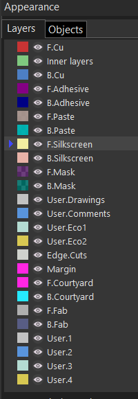

- As for other layers F.Cu and B.Cu are copper layers of the PCB itself 
- Solder mask is a thin polymer protective coating applied to all non-conductive areas and during manufacturing to prevent solder from going to unwanted areas. 
- Edge Cuts for creating the boundary of a PCB so the manufacturer knows the boundary at which to cut the board outline

After that, creating a footprint is simple. Place pads and allign the dimensions as shown in the mechanical drawing. Make sure when drawing silkscreen or courtyard to select the right layer before placing lines as the line will become whatever layer you are selected on.  

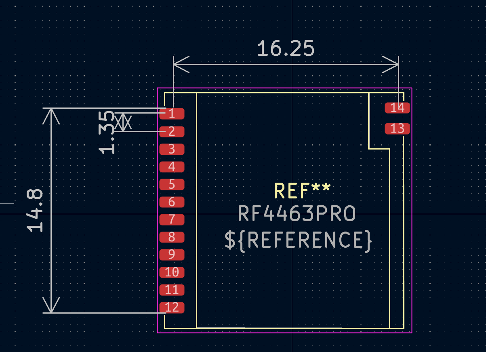

Use dimension tools to accurately design the footprint. Once done save the footprint and attach to the correct symbol. 

Great job!

# **Importing Project Specific Libraries**

What are Project Specific Libraries? These are libraries you have imported that are only included within that project and not over all of your projects. The point is so that we are pulling symbols from files in the ISS Libs folder only when needed.

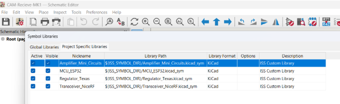

- Click Preferences > Manage Symbol Libraries > Project Specific Libraries

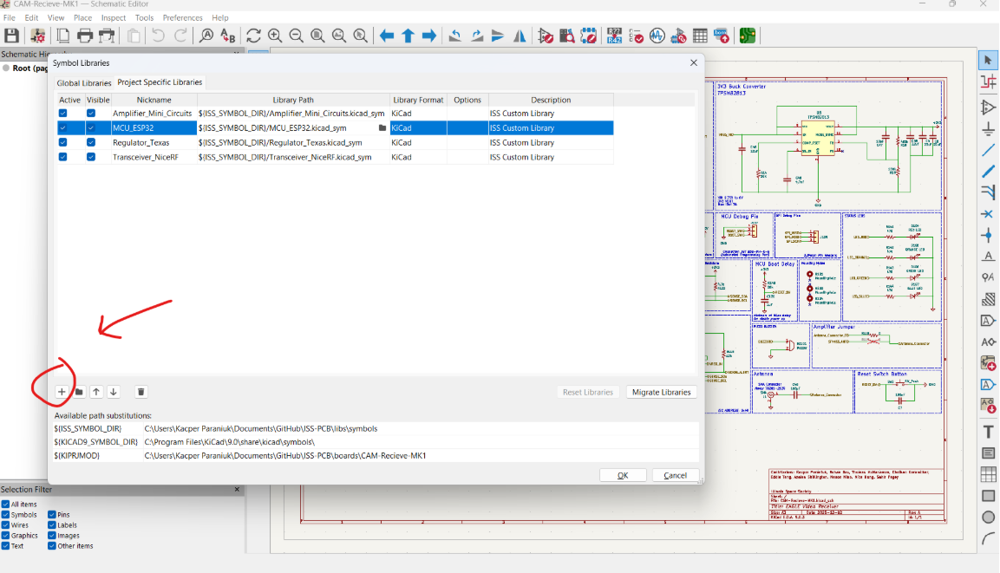

- Click “+” in the bottom left of the pop up. 

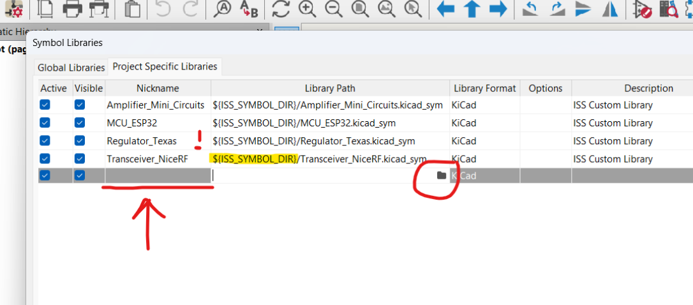

- The redline indicates the name of the library make sure it follows library conventions,  
    - Should be named with the exact same formatting as folder: “What it is” + “_” + “company who made it”

- Click the folder icon and find the ISS Symbol file and add your .kicad_sym

- The highlighted part is the directory pathway, make sure it is linked properly inside your folder with {ISS_SYMBOL_DIR}

- Once done look up your library in symbols to make sure it comes up!

# **Creating Hierachical Sheets & Linking Hierachical Labels**

Create hierarchical sheets when dividing sections of a PCB. 

- Click S to draw the box that will connect to a sheet. 

- Name both the Sheet Name & File Name to the same name. 

- Right click the box and click "Autoplace All Sheet Pins." Unnecessary pins can be connected to a no connect flag or deleted.

- Connect subsequent hierachical labels to create connections between different sheets/files. 

# **Layout Tutorials** 

### **Setting Up Design Rules Constraints (DRC)**

How you configure the design rules constraints depends on the manufacturer. These standards/constraints are set by the companies and the rules can be derived from their website. 

You can manually input these design constraints as shown:

This page is accessed by clicking File (in the top left corner of the KiCad layout screen) 

File > Board Setup... > Design Rules > Constraints 

OR you can import these constraints from other projects by clicking the button shown in the image: 

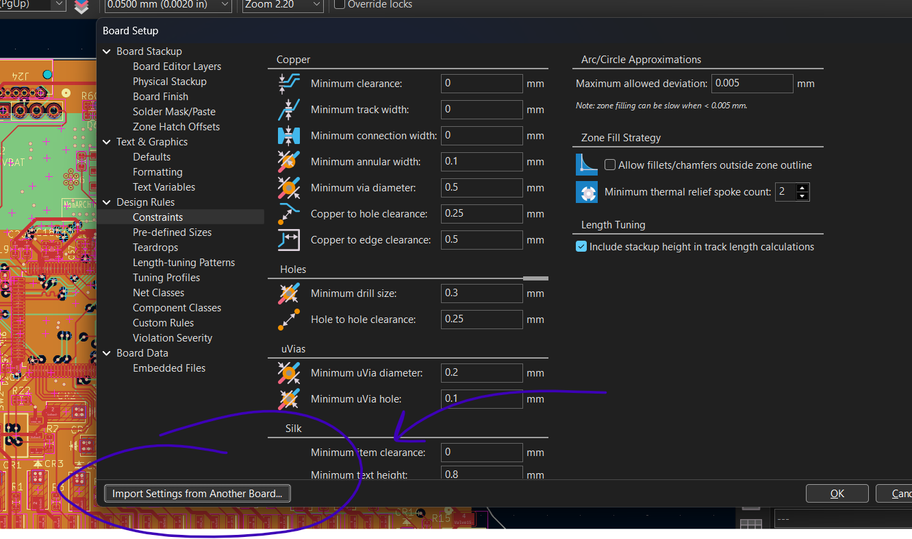

Information about design constraints can be found at [JLCPCB Design Rules](https://jlcpcb.com/capabilities/Capabilities) - these are the design constraints JLCPCB imposes, the manufacturer we use. 

### **Trace Impedance Matching**

Correct trace impedances are crucial for differential pairs such as USB Lines (D+, D-) for signal integrity, noise rejection, and data reliability. 

We sometimes encounter differential pairs that need to have a set trace impedance. Usually when we are routing D+/D- lines from USB to the MCU. 

In order to correctly route differential pairs for a USB click Route -> Route Differential Pair -> then click the D+/D- line. 

You can also compute different traces using the KiCad calculator seen in the KiCad main menu.  
 
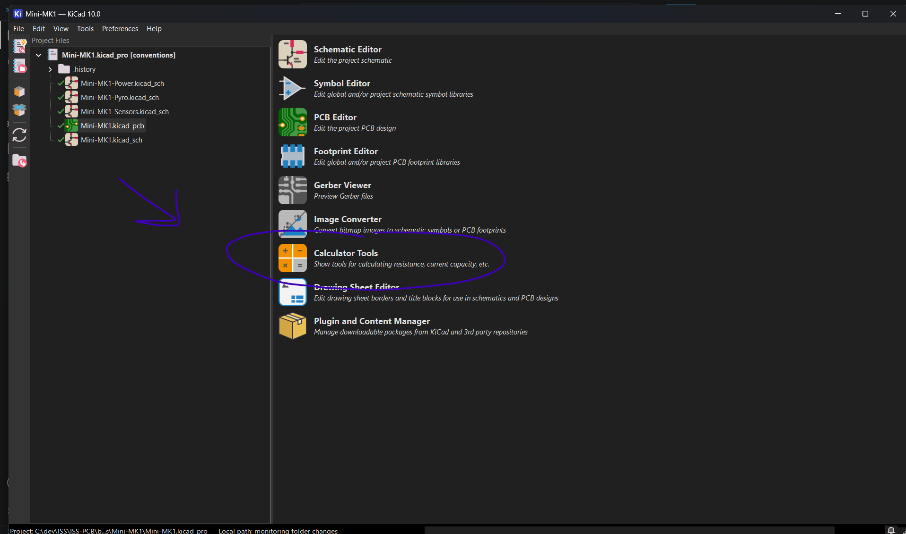

Additionally, JLCPCB and digikey have calculators that can be used. The former is very helpful cause it takes the board stackup into account automatically.

### **Trace Sizing** 

Trace sizing is determined based on estimated current and voltage the trace will experience. 

- For regular digital signal lines we use: 0.127 mm for trace width 

- For USB_POWER we use: .5 mm for trace width 

However, these trace widths aren't computed thoroughly and there isn't a convention for how big they should be. The trace width should be sized proportionally to it's estimated current/voltage load. 

### **RF Circuitry** 

Remember in E-hardware everyone is learning, even the leads, especially about topics like black magic (RF). Thus, no conventions have been strictly made as we are continously learning about how to build proper SRAD RF designs. You are more than welcome to add to this part of the md. 

*Usually for our purposes RF traces almost always have a 50 ohm impedance, however, this is not ALWAYS the case*

# **Instrumentation Tutorials**

## **Cool Gear ISS Has**

- Saleae Logic 8
- ImmersionRC RF Power Meter V2.1 

Links to relevant tutorials that members can follow:

Having trouble understanding? Not able to comprehend what is being said? Look for more resources online!

### **How to Use a Multi-Meter**

[How to Use a Multi-Meter](https://www.fluke.com/en-us/learn/blog/maintenance-monitoring/how-to-use-a-multimeter-guide?srsltid=AfmBOooOov8y1lksl45oFvikktbbUz0WOkd9BCdefhF9C1y00ccKMdOo)

### **How to Use an Oscilloscope**

[How to Use an Oscilloscope](https://www.youtube.com/watch?v=LaY47Qrfs0c)

### **How to Use a Digital Logic Analyzer**

[How to Use a DLA](https://articles.saleae.com/logic-analyzers/what-is-a-logic-analyzer)

### **How to Solder**

Checkout Week 3 on 2026 Onboarding [How to Solder Slides](https://uofi.app.box.com/folder/401706100793) in the UIUC Box

# **Electronic Learning Resources** 

- [EEVblog](https://www.youtube.com/@EEVblog)
- [Ben Eater](https://www.youtube.com/@BenEater)
- [The Engineering Mindset](https://www.youtube.com/@EngineeringMindset)

*See a typo? Think we left some vital information out? Make a branch and edit this file!*

