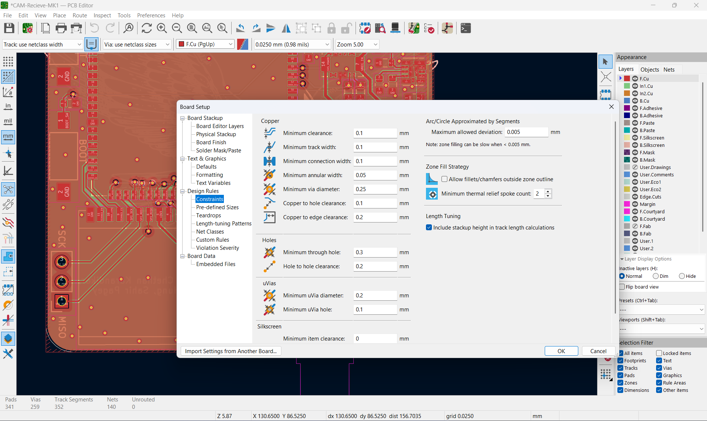

# **How-To KiCAD Fundamentals**

*Author(s): Kacper Paraniuk*

## Table of Contents

- [Symbols](#symbol-libraries)
    - [Finding ISS Symbol Library](#finding-iss-symbol-library)
    - [Setting Up Symbol Directories](#setting-up-symbol-directories)
- [Layout Tutorials](#layout-tutorials)
    - [Setting Up Design Rules Contraints](#setting-up-design-rules-constraints-drc)
    - [Trace Impedance Matching](#trace-impedance-matching)
    - [Trace Sizing](#trace-sizing)

# **Symbol Libraries**

### **Finding ISS Symbol Library** 

The location in your directory where ISS-PCB is located > ISS-PCB -> Libs > Symbols 

.kicad_sym are libraries of symbols not symbols themselves thus we will want to import a symbol into the correct library or create a new library if needed when importing or creating new symbols. 

Find a graphic version of the ISS-PCB directory [here](https://github.com/ISSUIUC/ISS-PCB/blob/conventions/CONTRIBUTING.md#library-directory)

### **Setting Up Symbol Directories**

Take a look at [Contributing Page](https://github.com/ISSUIUC/ISS-PCB/blob/conventions/CONTRIBUTING.md#custom-library-paths) for a tutorial. 

Ensure symbol names follow ISS conventions seen in [ISS Library Conventions](https://github.com/ISSUIUC/ISS-PCB/blob/conventions/CONTRIBUTING.md#iss-library-convention)

# **Layout Tutorials** 

### **Setting Up Design Rules Constraints (DRC)**

### **Trace Impedance Matching**

### **Trace Sizing** 

https://www.ultralibrarian.com/ << add to symbol >>