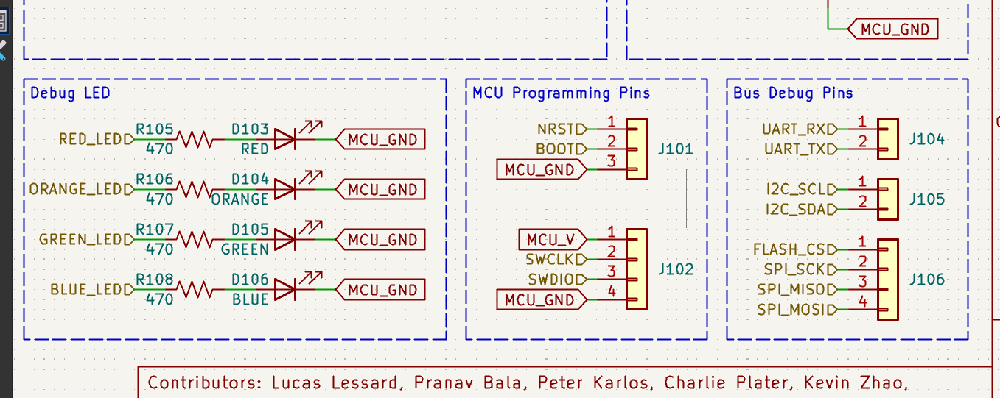
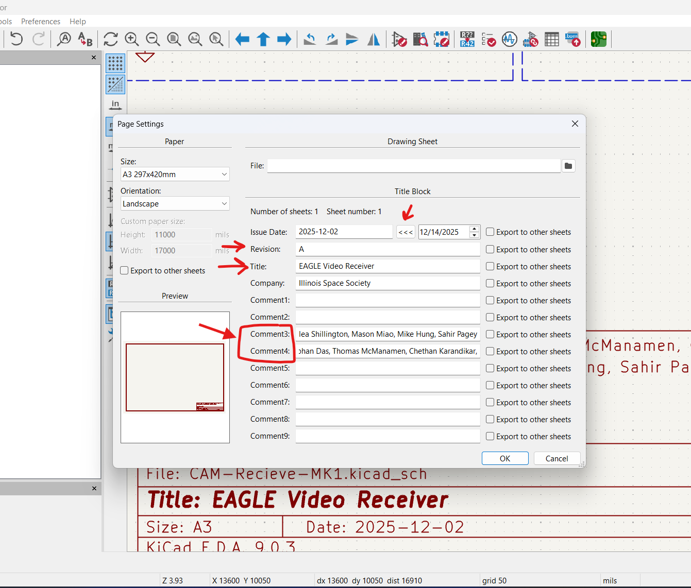
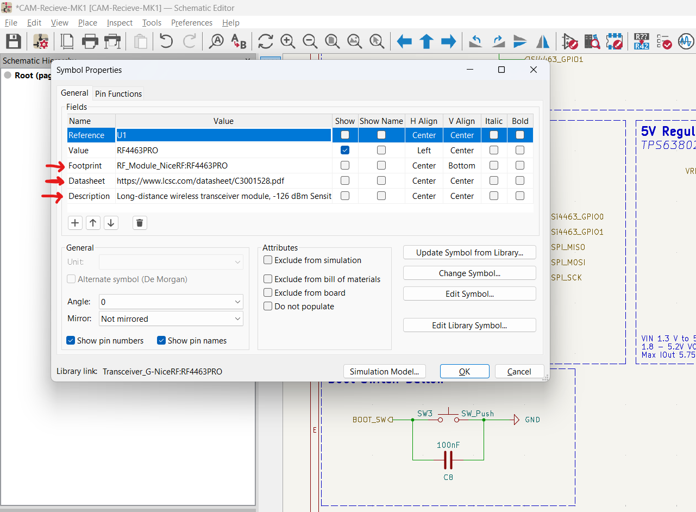
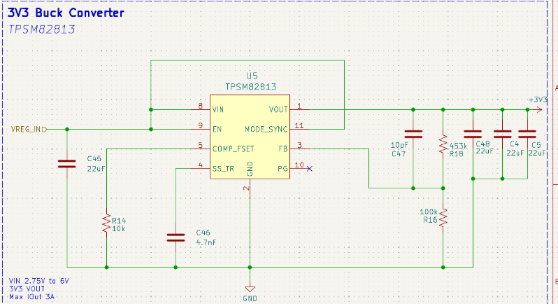
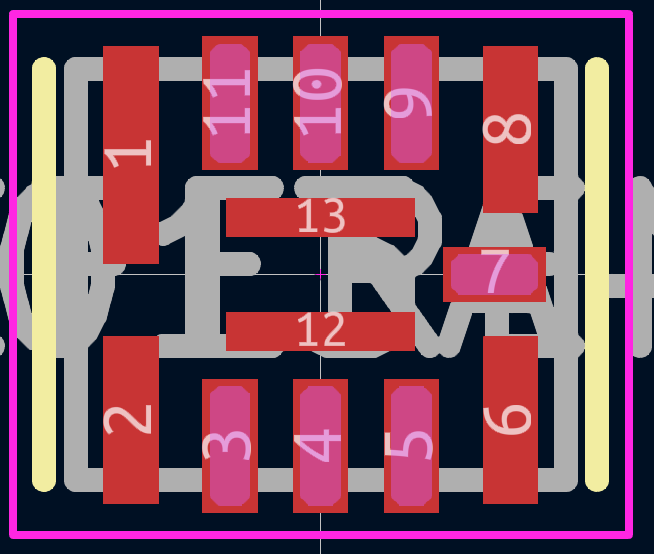
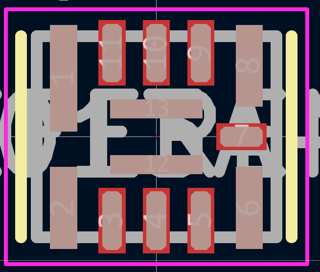

# **ISS E-Hardware PCB Conventions**

*Author(s): Peter Giannetos, Kacper Paraniuk*

A non-exhaustive guide of how to create neat KiCAD schematics. Schematics that do not adhere to these guidelines will not be permitted to merged to main.

Please check each project with the following checklist: ➡️ [ISS E-hardware Conventions](https://uofi.app.box.com/folder/404099229358) ⬅️ before submitting a PR 
## Table of Contents

- [Intro](#intro)
- [Consistency](#consistency)
- [Structure](#structure)
- [Wires & Labels](#wires--labels)
- [Symbols](#symbol-conventions)
- [Schematic](#schematic-conventions)
- [Footprint](#footprint-conventions)

 

# **Intro**

You are a graphic designer that works with electrons.

# **Consistency**

Whenever making a formatting decision, it is vital to maintain consistency across the schematic with whatever formatting convention you choose. Essentially, pick something and stick with it whether that be what's listed in this file or the KLC. 

 

# **Structure**

### Text & Page Size

Text width should be no smaller than 1.27mm in order to be readable if printed. The schematic size can be of any size as long as projects with multiple boards or sheets maintain a consistent size.

### Partitions

Components should be sectioned off and grouped based on functionaility. The box title describes the general functionality while the subtitle describes the main component partnumber or other design defining information. Sometimes a subtitle isn't needed. Alternatively some schematics draw lines across the full length of the schematic to divide sections. Regardless of the method, always find a way to consistently group similar circuits together and clearly annotate them.

- Box Border: 0 Width (Default)
- Dashed Line Border
- Box Title: 2mm Bold 
- Box Subtitle: 2mm Italic
- Has a Title in bold with font: **KiCad Font** and Part Name under title with font: **Default Font**
- Extra information should be 1.2 mm sized. 

EXCEPTION: Small peripheral partitions can have:

- Box Title: 1.27 mm **KiCad Font** 

If a component needs a description or link to an external resource place it in the bottom left or right of the box depending on best fit.

## Examples

- I2C Addresses listed in a convenient location inside the sectioned off box. 
- Including calculations for voltage dividers, amplifiers, charging/discharging, etc...
- Rationale for specific passive values
- Rationale for do-not populate (DNP)
- Maximum/minimum inputs/outputs for voltage/current. 
- Links from inspired by circuits / examples

### Title Block

Always fill out the Title Block and add Contributors, Date, Revision, and a Project Name.

- Contributing member names inserted (“Comment 3” and “Comment 4”)
- Project name typed into (“Title”) 
- Fill in issue Date by clicking <<< arrows
- Company = Illinois Space Society 

#### Revisions 

- A = First revision 
- B = Second revision 
- C = Third...
- So on. 

See [ISS KiCAD Project Naming](https://github.com/ISSUIUC/ISS-PCB/blob/conventions/CONTRIBUTING.md#iss-kicad-project-naming) for project naming conventions.  

### Grid Size

Keep the grid size as large as possible. The typical size is 1.27mm for components and wires. Text, labels, and graphics may be placed on a 0.635 mm grid for better alignment. The grid size can sometimes be found at a corner of the schematic.

### Overlapping

Avoid overlapping text, reference designators, and symbols.

 

# **Wires & Labels**

### Net Names

Net names should be capitalized and contain no spaces. Use "_" instead of spaces.

### Labels

Don't use global labels. Hierarchical labels are always the prefered label.

Any text should always face up (Never to the side where someone looking at the schematic has to tilt their head)

### Power Rails

Power flags should always face upwards, and GND flags should face downwards. Whenever a voltage has a decimal it should be replaced with "V" (Ex: 3.3V = 3V3) Power *labels* may face sideways if a power flag can not be used. Input and output power components such as regulators may have sidways power labels. (Flags are not the same as labels)

### Wire Crossing

Four way intersections are ambiguous. At most intersections should be limited to three wires. If there is no green dot then the wires are not connected and just passing over. But unconnected wire crossing should also be avoided if possible.

# **Symbol Conventions**

### Reference Designators 

Ensure symbol has proper [Reference Designator](#reference-designators) assignment

Assign Reference designator according to IEEE standards (listed below)

| Reference Designator | Component              |
| --------------------- | --------------------- |
| `R`                   | Resistor              |
| `C`                   | Capacitor             |
| `D`                   | Diode                 |
| `Q`                   | Transistor (or `TR`)  |
| `U`                   | Integrated Circuit (IC) |
| `L`                   | Inductor              |
| `J`                   | Connector, Jack       |
| `K`                   | Relay                 |
| `S`, `SW`             | Switch                |
| `F`                   | Fuse                  |
| `TP`                  | Test Point            |
| `W`                   | Wire, Cable           |
| `B`                   | Battery               |

### Power Pins 

Ensure GND pins are on the bottom and power pins (VCC) are on top of the symbol

Overlap GND/Power/Identical Pins - "Many symbols have corresponding footprints where multiple physical pins are connected to a single logical net." For more [info](https://klc.kicad.org/symbol/s4/s4.3/)
- One pin should be visible, all the others should have visibility check box turned off and electrical type set to “Passive” 

#### Exception 

- Be mindful when combining power pins. There are nuances to power supplies that should not be ignored such as for DVDD and AVDD where different 3V3s may be combined or needed to be seperated based on the application. Ask a lead if not sure. 

### Symbol Cosmetics 

Fill every symbol/connector with body background color  “L.yellow” or #FFFFC2FF

Symbols should be as small as possible without distortion or weirdness. 

### Symbol Properties 

- Footprint Assigned 
- Datasheet Assigned
- Short concise description 

No Connect (NC) pins
- Visibility check box turned off
- Set Electrical Type to “Unconnected”	

Pins are not used/connected to make sure to place “no connect flags” 

Pins with similar functions should be grouped together:
- SPI_MISO, SPI_MOSI, SPI_CS, SPI_CLK
- UART_TX, UART_RX

Electrical Type of the pins to the symbol are correctly selected
- Power/GND Pins = “Power input”
- Input pins = Input 
- Output pins = Output
- Both input / output = bidirectional

# **Schematic Conventions**

### Custom Symbols

When creating and managing custom libraries take a look at our guide!

➡️ [Custom Library Creation](./HOW-TO.md) ⬅️

Additionally look towards similar symbols for general formatting questions. Above all else follow the KiCAD Library Conventions.  

➡️ [KiCAD Library Conventions](https://klc.kicad.org/) ⬅️

### US Resistors

Always use "R_US" resistors and not the rectangular "R" resistors.

### Small Components

Use regular sized components and not their alternative small symbols.

### Units

Use the value field in passive components to display their characteristics.   
Note: There shouldn't be a space between the numeric value and the prefix/unit.   
*Example: `5pF` = 5 pico-farads*

| Prefixes | Description       |
| -------- | ----------------- |
| `p`      | Pico: $10^{-12}$  |
| `n`      | Nano: $10^{-9}$   |
| `u`      | Micro: $10^{-6}$  |
| `m`      | Milli: $10^{-3}$  |
| `k`      | Kilo: $10^{3}$    |
| `M`      | Mega: $10^{6}$    |

| Units    | Description                          |
| -------- | ------------------------------------ |
| ` `      | Ohm: Resistance (No symbol in KiCAD) |
| `F`      | Farad : Capacitance                |
| `H`      | Henry: Inductance                    |

### Connectors

Use the generic yellow solid fill connectors and not the other male/female types.

### Voltage Regulators 

Voltage Regulators VIN pin should be top left and VOUT should be top right of the symbol 

# **Footprint Conventions**

When creating footprints always follow the mechanical section of the datasheet to get a thorough layout of the dimensions to follow. 

Follow our tutorial for [Creating a Footprint](https://github.com/ISSUIUC/ISS-PCB/blob/conventions/HOW-TO.md#creating-a-footprint)

### Pin Number One

Although not necessary it is helpful to put a silk screen indicator by pin number one of the component for later when soldering. 

### Courtyards 

Each symbol should have a courtyard (Pink outline) if not add one by clicking the courtyard layer (respective front/back) that is a little bigger than the component itself. 

### Solder Paste 

Make sure BOTH F.paste and F.mask layers have filled in solder paste

### Traces

#### Trace Impedances 
Correct trace impedances are crucial for differential pairs such as USB Lines (D+, D-) for signal integrity, noise rejection, and data reliability. 

Follow [Trace Impedance Matching](https://github.com/ISSUIUC/ISS-PCB/blob/conventions/HOW-TO.md#trace-impedance-matching) guide to learn more. 

#### Trace Sizes 

Determine based on estimated current and voltage what size of trace is needed. 

Follow [Trace Size](https://github.com/ISSUIUC/ISS-PCB/blob/conventions/HOW-TO.md#trace-sizing) guide to learn more. 

   

*See a typo? Think we left some vital information out? Make a branch and edit this file!*
