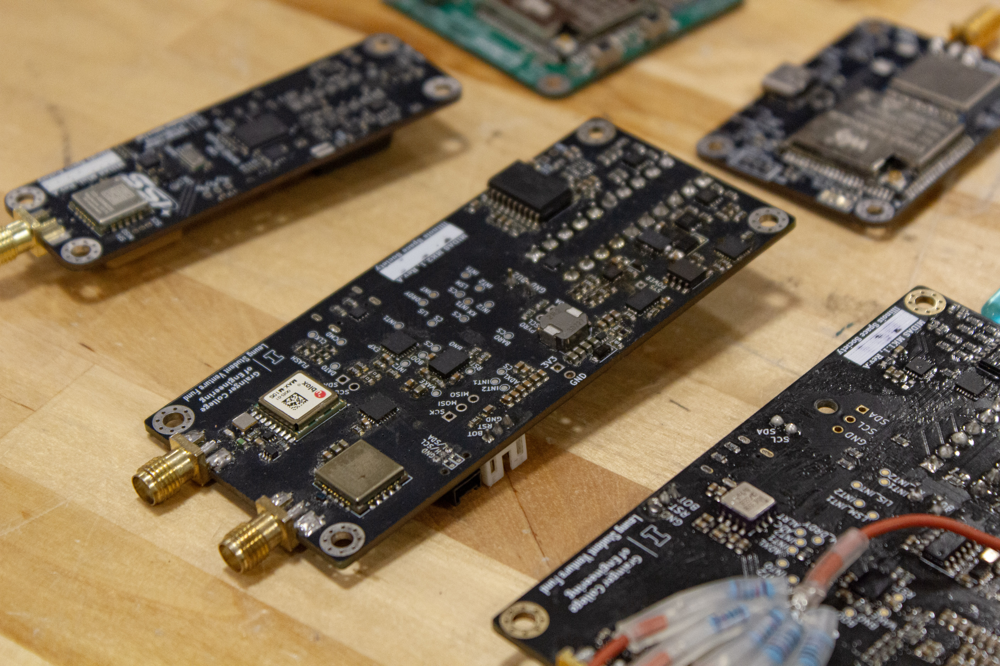

# Welcome to the ISS-PCB repo! 🖥️⚙️⚡

# Repository Overview

* Archive: Moved to the [Archive](https://github.com/ISSUIUC/ISS-PCB-Archive) repo... check it out! 😁
* Boards: Contains all of the present boards the team is working on
* Docs: Contains various documents pertaining to PCB designs
* Libs: Contains various templates, symbols and footprints that we use when designing PCBs
* Scripts: Contains various codes used in PCB development
* Markdown Files: 
    - README.md: Introduces the ISS-PCB-Repo and pertinent information to become an amazing E-Hardware member
    - ISS-PCB-CONVENTIONS.md: Sets conventions to be followed when desiging for the ISS-PCB KiCad repo
    - HOW-TO.md: Presents brief and thorough lessons on important KiCad tools, documenation procedures, and design processes
    - GITHUB.md: An introduction to GitHub and how to use it for KiCad
    - CONTRIBUTING.md: Showcases how to setup KiCad and contribute proper work to E-Hardware. Additionally, introduces many conventions of ISS-PCB folder. 

When you commit changes to the repository, they will generally be found in the Boards folder. 

# E-Hardware PCB Documentation 

* You can find documentation about all of our PCBs in the [Spaceshot Members Box Folder](https://uofi.app.box.com/folder/273741222408). 
    - Alternatively, [Members] Spaceshot > Avionics > Development 

# How to contribute:
There are many ways to contribute to the PCBs that we build for the rocket and its accompanying systems. The timeline for building a PCB is usually as follows: 

* Formulate the requirements of the board
* Research different chips, understand their functionalities, and determine if we can use it for our purposes
* Build the board schematic using the datasheets of different chips 
* Route the board 
* Once the board is manufactured, solder all the components onto the board
* Debug the board 
* Document the board (this should be done throughout the process as well) 

Every part of constructing a PCB is hands-on, and there are lots of ways to get involved. 

To have your changes reflected on the board, it is important to commit your changes to the Github repository. To learn how to commit changes, check out the [Contributing Guide](/CONTRIBUTING.md).

# Useful Links:
Here are some links you may find useful as you are building PCBs: 

* [KiCad](https://www.kicad.org/) - software used for designing PCBs 

* [KiCad Library Conventions](https://klc.kicad.org/) - guidelines for creation of symbols, footprints, and 3D models in KiCad

* [DigiKey](https://www.digikey.com/) - used for looking up various electronic components

* [Mouser](https://www.mouser.com/) - used for looking up various electronic components

* [JLCPCB](https://jlcpcb.com) - the PCB manufacturer we primarily use

* [JLCPCB Design Rules](https://jlcpcb.com/capabilities/Capabilities) - the design constraints JLCPCB imposes

Thanks for reading, and good luck in building PCBs! 

*See a typo? Think we left some vital information out? Make a branch and edit this file!*

