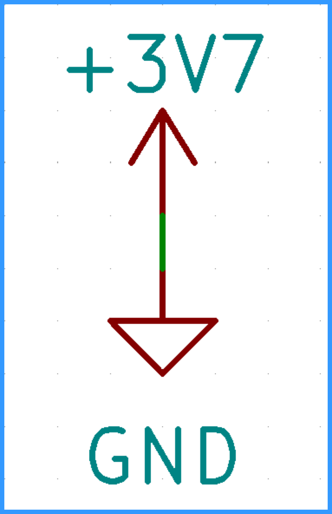
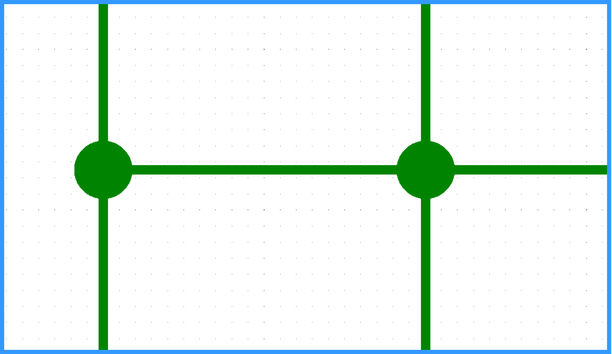
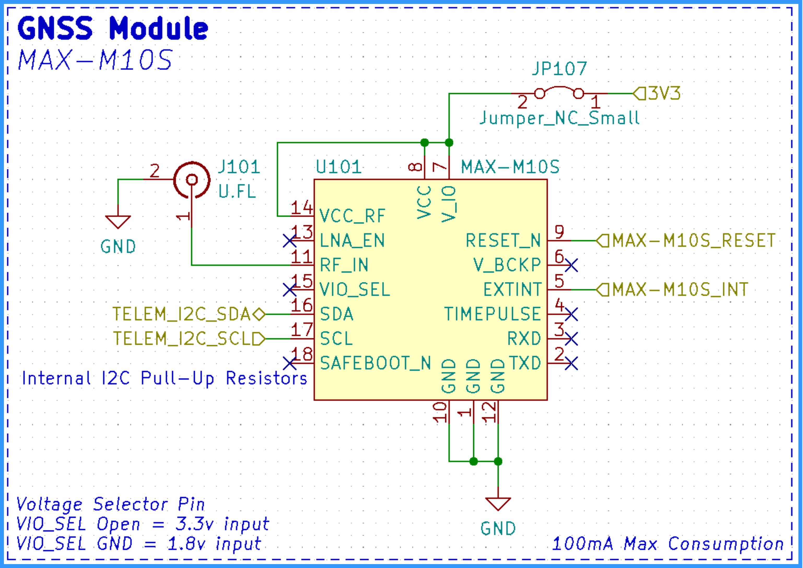
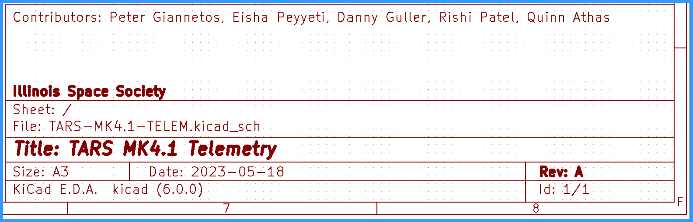
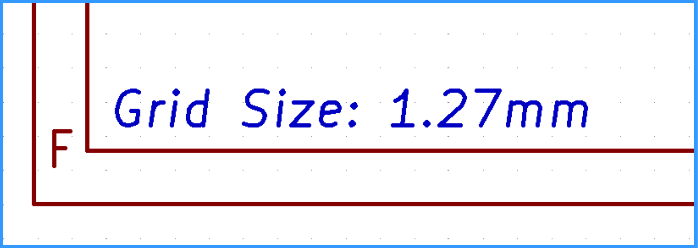
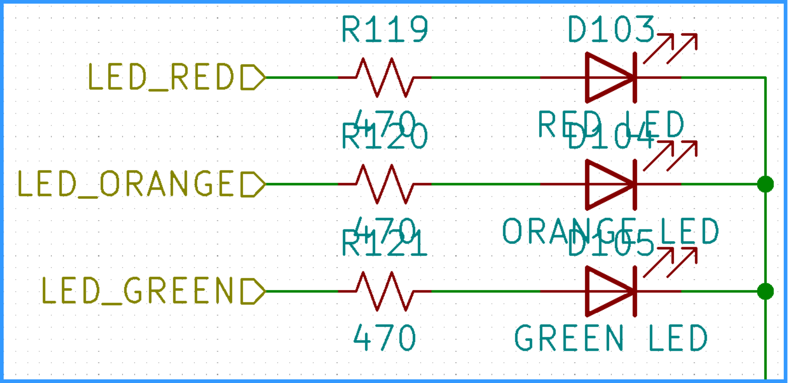
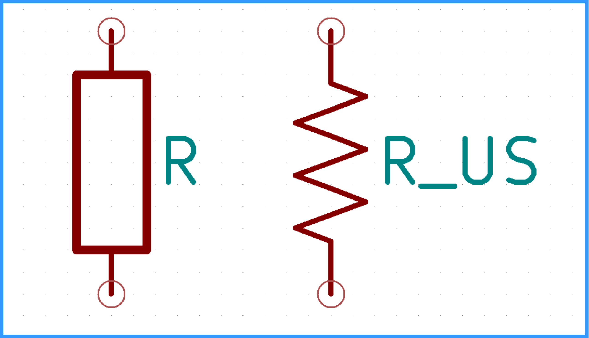
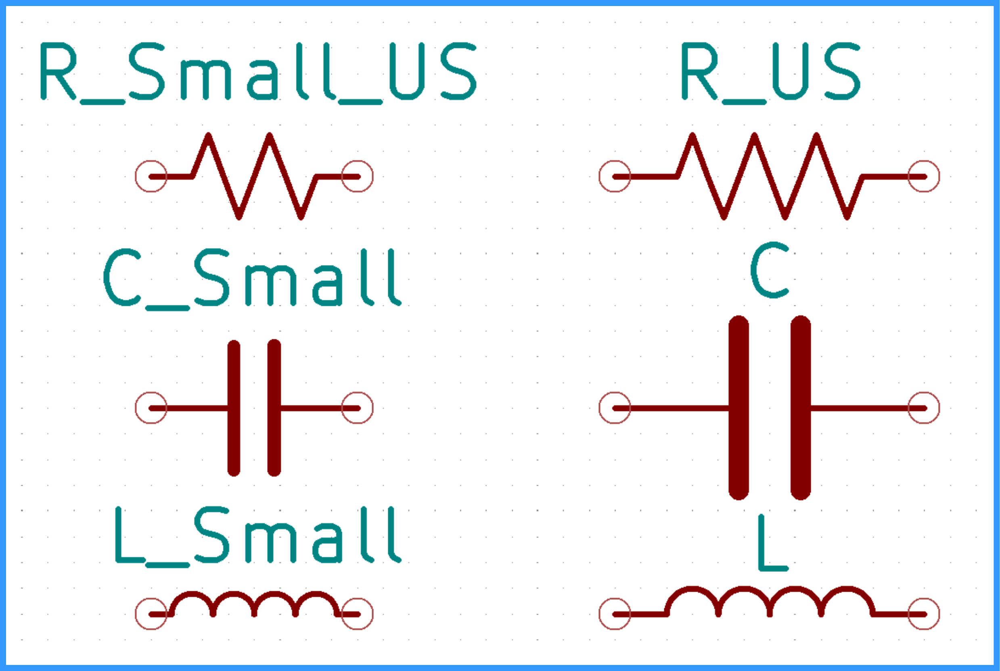
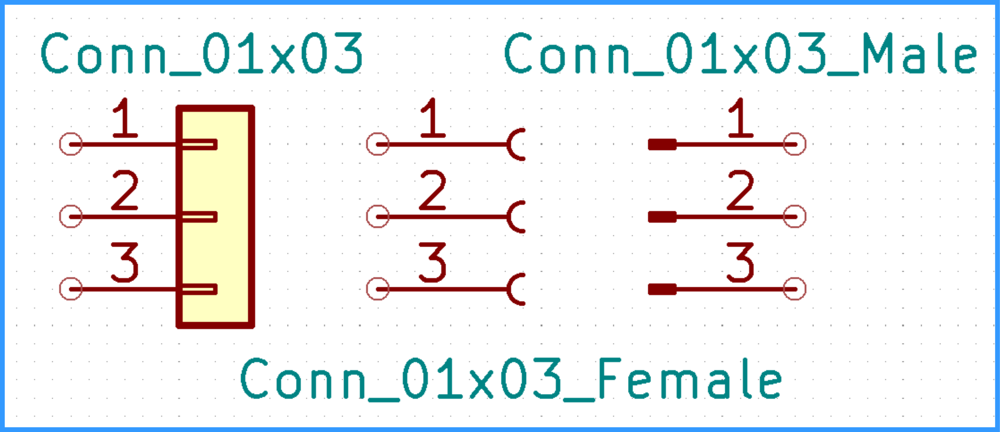
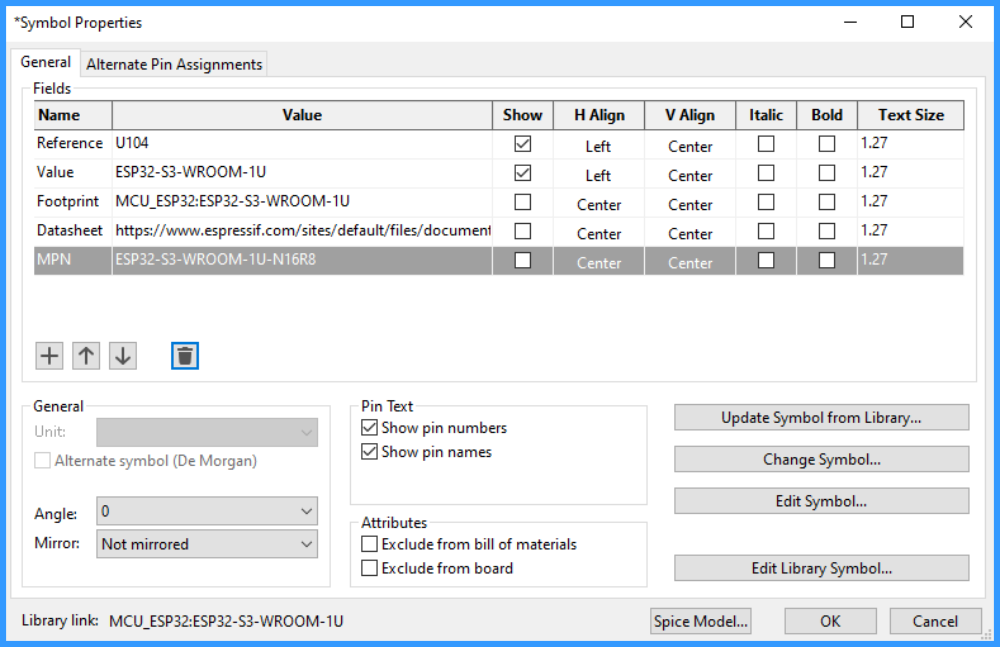

# **Schematic Conventions**

*Author(s): Peter Giannetos*

A non-exhaustive guide of how to create neat KiCAD schematics. Schematics that do not adhere to these guidelines will not be permitted to merged to main.

## Table of Contents

- [Intro](#intro)
- [Consistency](#consistency)
- [Wires & Labels](#wires--labels)
- [Symbols](#symbols)
- [Structure](#structure)

 

# **Intro**

You are a graphic designer that works with electrons.

# **Consistency**

Whenever making a formatting decision, it is vital to maintain consistency across the schematic with whatever formatting convention you choose. Essentially, pick something and stick with it.

# **Wires & Labels**

### **Net Names**

Net names should be capitalized and contain no spaces. Use "_" instead of spaces.

### **Labels**

Don't use global labels unless necessary. Hierarchical labels are the prefered label in most situations.

<!---
Three label image idea with names as label
-->

### **Power Rails**

Power flags should always face upwards, and GND flags should face downwards. Whenever a voltage has a decimal it should be replaced with "V" (Ex: 3.3V = 3V3) Power *labels* may face sideways if a power flag can not be used. Input and output power components such as regulators may have sidways power labels. (Flags are not the same as labels)

### **Wire Crossing**

Four way intersections are ambiguous. At most intersections should be limited to three wires. If there is no green dot then the wires are not connected and just passing over. But unconnected wire crossing should also be avoided if possible.

 

# **Structure**

### Text & Page Size

Text width should be no smaller than 1.27mm in order to be readable if printed. The schematic size can be of any size as long as projects with multiple boards maintain a consistent size.

### Partitions

Components should be sectioned off and grouped based on functionaility. The box title describes the general functionality while the subtitle describes the main component partnumber or other design defining information. Sometimes a subtitle isn't needed. Alternatively some schematics draw lines across the full length of the schematic to divide sections. Regardless of the method, always find a way to consistently group similar circuits together and clearly annotate them.

- Box Border: 0 Width (Default)
- Box Title: 2mm Bold
- Box Subtitle: 2mm Italic

### Title Block

Always fill out the Title Block and add Contributors, Date, Revision, and a Project Name.

### Grid Size

Keep the grid size as large as possible. The typical size is 1.27mm for components and wires. Text, labels, and graphics may be placed on a 0.64mm grid for better alignment. The grid size can sometimes be found at a corner of the schematic.

### Overlapping

Avoid overlapping text, reference designators, and symbols.

 

# Symbols

### Custom Symbols

When making custom libraries look towards similar symbols for general formatting questions. Above all else follow the KiCAD Library Conventions.  
➡️ [KiCAD Library Conventions](https://klc.kicad.org/) ⬅️

### US Resistors

Always use "R_US" resistors and not the rectangular "R" resistors.

### Small Components

Use regular sized components and not their alternative small symbols.

### Units

Use the value field in passive components to display their characteristics.   
Note: There shouldn't be a space between the numeric value and the prefix/unit.   
*Example: `5pF` = 5 pico-ferrites*

| Prefixes | Description       |
| -------- | ----------------- |
| `p`      | Pico: $10^{-12}$  |
| `n`      | Nano: $10^{-9}$   |
| `u`      | Micro: $10^{-6}$  |
| `m`      | Milli: $10^{-3}$  |
| `k`      | Kilo: $10^{3}$    |
| `M`      | Mega: $10^{6}$    |

| Units    | Description                          |
| -------- | ------------------------------------ |
| ` `      | Ohm: Resistance (No symbol in KiCAD) |
| `F`      | Ferrite : Capacitance                |
| `H`      | Henry: Inductance                    |

### Connectors

Use the generic yellow solid fill connectors and not the other male/female types.

   

*See a typo? Think we left some vital information out? Make a branch and edit this file!*

<!--
TO DO:
# **Templates**

## MPN

Add an extra field called MPN (Manufacturer Part Number) to each symbol and then respond 

-->